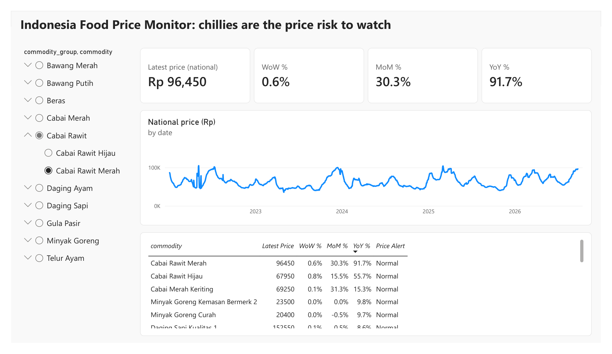
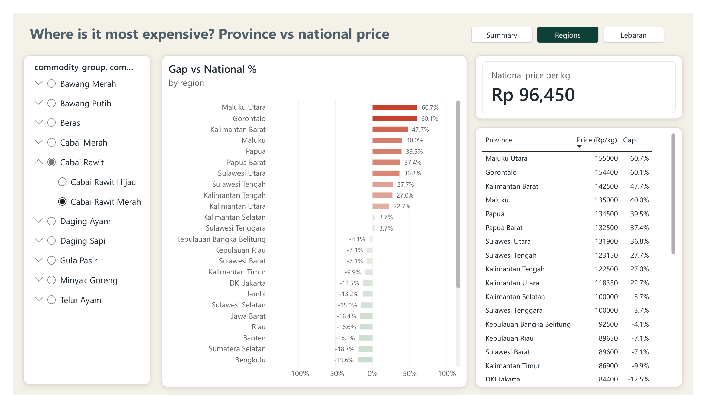
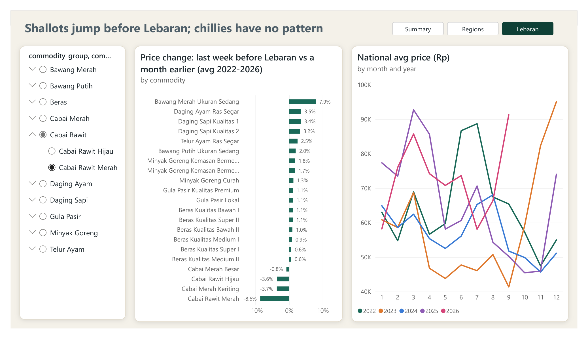
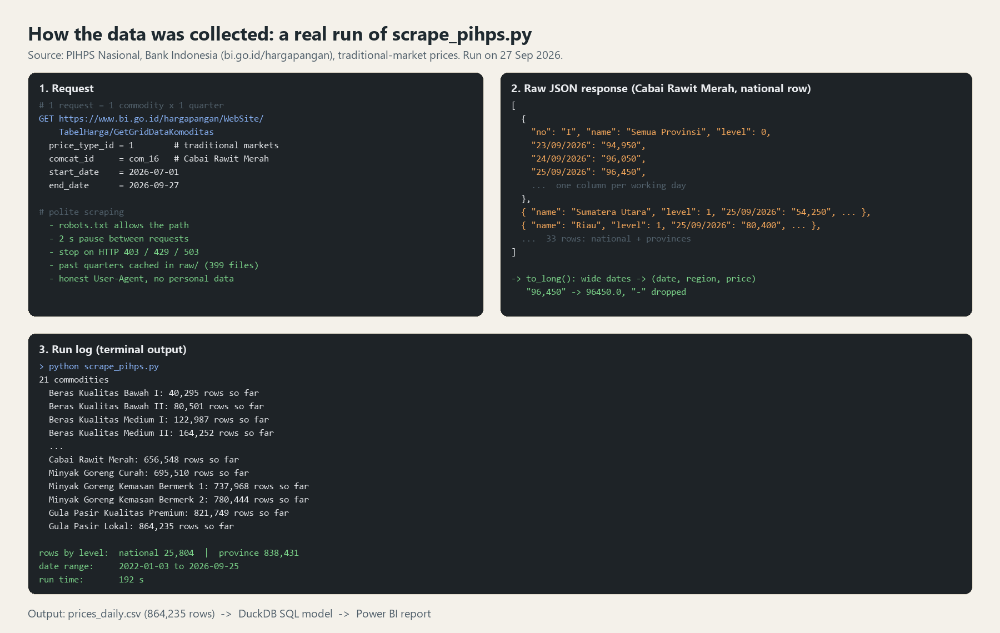

# Indonesia Food Price Monitor

An automated pipeline and Power BI dashboard that tracks the daily prices of 21 staple foods across Indonesia's 34 provinces. The data comes from Bank Indonesia's PIHPS Nasional.

**Question:** which staple foods carry the most price risk right now, where are they most expensive, and do prices rise before Lebaran?



## Key findings (data to 25 Sep 2026)

1. **Chillies are the main price risk.** The national price of cabai rawit merah is Rp 96,450/kg. That is 30.3% higher than a month ago and 91.7% higher than a year ago. Every staple other than chillies moved less than 10% year on year.
2. **Chillies cost much more in eastern Indonesia.** In Maluku Utara, cabai merah besar costs 2.3 times the national average. Cabai rawit hijau costs 2.2 times the national average there. For cabai rawit merah, Maluku Utara and Gorontalo are about 60% above the national price.
3. **Shallots jump before Lebaran; chillies have no pattern.** The measure compares the national price in the last week before Lebaran with the price a month earlier, over the five Lebarans from 2022 to 2026:
   - **Shallots:** +7.9% on average. They rose in 3 of the 5 years: +8%, +12% and +21%.
   - **Beef:** about +3%. The rise is small, but it happened every year.
   - **Chicken:** +3.5% on average. Most of that comes from 2022; the other years were close to 0.
   - **Chillies:** anywhere from -38% to +19%, so there is no pre-Lebaran pattern.
4. **All 20 active price alerts are chillies.** An alert is a province where a price moved more than 10% in one week.




## How it works



```
bi.go.id PIHPS JSON  ->  scrape_pihps.py  ->  prices_daily.csv (864k rows)
                                                   |
                                             build_model.py (DuckDB SQL)
                                                   |
                    star schema + KPI tables  ->  Power BI report (DAX measures)
                                                   |
                                             export_public.py  ->  public/ (aggregates only)
```

**`scrape_pihps.py`**
- Calls the public JSON endpoint behind the PIHPS "Tabel Harga" page.
- Collects 21 commodities, national level and all provinces, traditional markets, from 2022 to today.
- Requests one quarter at a time, waits 2 seconds between requests, and caches every response.
- Stops immediately on HTTP 403, 429 or 503.

**`build_model.py`** uses DuckDB SQL to build these tables:
- `dim_commodity`, `dim_region` and `dim_date`. The date table includes days to the next Lebaran.
- `fact_price`.
- KPI tables:
  - latest price with week-on-week, month-on-month and year-on-year change
  - 90-day volatility
  - weekly alert flag
  - gap from the national price in each province
  - Lebaran effect: the average price in the last 7 days before Lebaran vs the 7 days around a month earlier

**Data-quality checks** (in `public/dq_checks.csv`):
- 0 duplicate commodity-region-day rows
- 0 non-positive prices
- 130 daily jumps above 50%, kept and flagged for review

**Lesson from the checks.** The first version compared single days (the day before Lebaran vs 30 days earlier). On the last working day before the 2022 holiday, few markets reported. On that day the national rice price jumped from Rp 10,450 to Rp 12,750, and it returned to normal after the holiday. That one day inflated the 2022 figures: chicken showed +7.7% on average, driven by a single +38.6% reading in 2022. The final measure compares 7-day averages, which absorbs one-day spikes.

**Power BI report** (3 pages, shown in the screenshots)
- The data is loaded as a star schema.
- The DAX measures are in `powerbi/measures.dax`. They include Latest Price, WoW / MoM / YoY %, Gap vs National % and Lebaran Change %.
- All three pages share a synced commodity slicer and page-navigation buttons.
- A custom theme (`powerbi/food_price_theme.json`), colour-coded price changes and monthly sparklines highlight where prices are rising.

**`.github/workflows/daily-refresh.yml`** re-runs the pipeline every weekday afternoon. Past quarters are cached, so each run downloads only the current quarter.

## Run it

```bash
pip install -r requirements.txt
python scrape_pihps.py      # first run takes about 30 minutes; later runs take about 1 minute
python build_model.py
python export_public.py
```

Then build the Power BI report on `model/*.csv` with a Python data source and the measures in `powerbi/measures.dax`. The `.pbix` file is not in this repository, because it embeds the raw daily prices.

## Data and limitations

- **Source:** PIHPS Nasional, Bank Indonesia (https://www.bi.go.id/hargapangan). Data © PIHPS Nasional.
  - This repository publishes only derived aggregates (`public/`). The raw daily responses are not redistributed.
  - The scraper follows bi.go.id/robots.txt.
- **Prices:**
  - All prices are traditional-market prices in Rp per kg (or per litre for cooking oil).
  - The province figure is PIHPS's own province average.
- **Lebaran effect:** it is an average of only five holidays. Read it as a pattern, not as a forecast.
- **Price movements:** chilli prices move with weather and harvest cycles. This project does not model those drivers.

## Next steps

- Add weather data (BMKG rainfall) to test the harvest link to chilli prices.
- Forecast the next 4 weeks of chilli prices with a simple time-series model.
